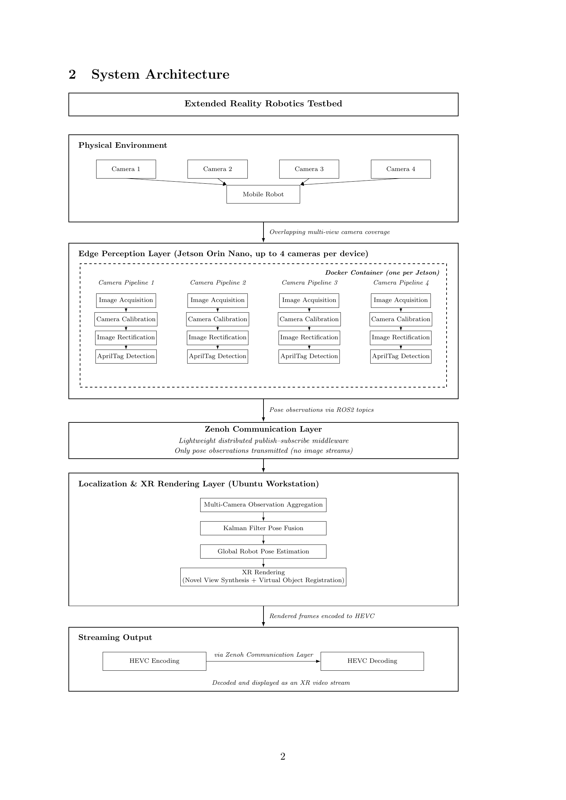
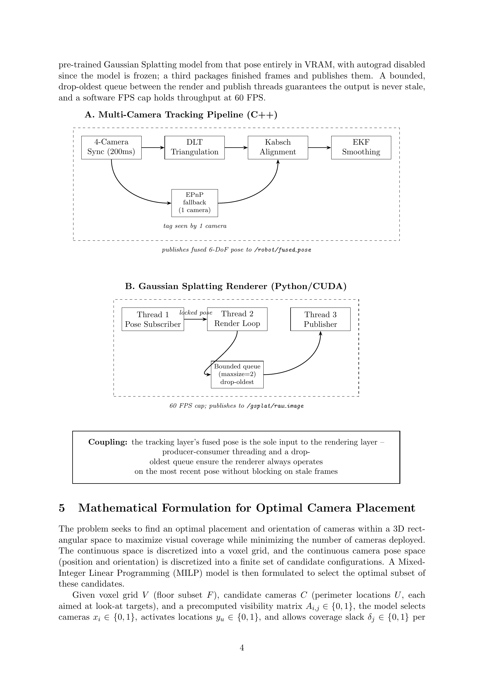
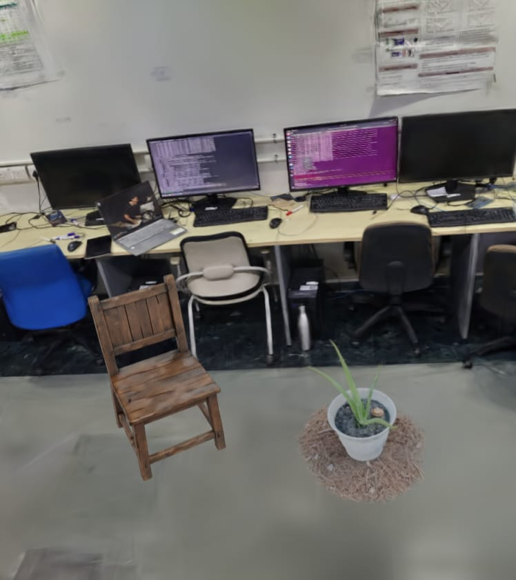
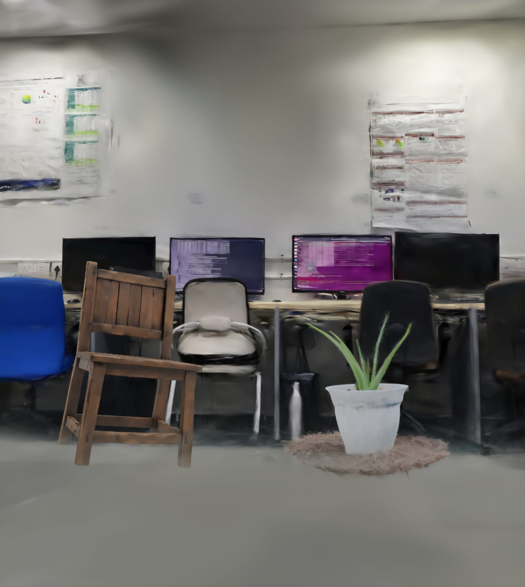

# Robotics Testbed — Jetson Deployment Stack

Localization & XR rendering layer of the **3DGS XR Testbed for Robots** project.

> **Note on the name:** despite the repo name, this stack is built for and runs
> on the **Ubuntu/RTX-4090 workstation**, not on the Jetson — the `Dockerfile`
> targets an RTX 4090 and `diagnose_ros2_network.sh` explicitly diagnoses ROS 2
> DDS connectivity *to the Jetson's AprilTag publisher container*. The
> Jetson-side camera + AprilTag detection code lives in
> [`multi-camera-launch-pipeline`](#related-repositories); this repo consumes
> its output.

This stack subscribes to the per-camera AprilTag detections published by the
Jetson rig, fuses them into a single globally-consistent 6-DoF robot pose,
renders the matching view from a pretrained 3D Gaussian Splat, and streams the
rendered frame back over the network as a live XR video feed.

## Where this fits



This repo implements the **Localization & XR Rendering Layer** and the
**Streaming Output** stage of the diagram above — everything downstream of the
Zenoh Communication Layer that carries pose observations in from the Jetson
rig in [`multi-camera-launch-pipeline`](#related-repositories).

## Pipeline

`full_pipeline.launch.py` brings up three ROS 2 nodes:



### 1. Multi-view tracker (`multi_view_tracker`, C++)

Subscribes to `tag_detections` from each of the 3 active cameras
(`/cam_25251947`, `/cam_25251937`, `/cam_25251936`) using a reentrant callback
group so all camera streams process concurrently, and buffers detections in a
**200ms time-synchronization window** (sized to tolerate Wi-Fi latency between
Jetson and workstation).

- When a tag is seen by **≥2 cameras**, its corner points are triangulated via
  **DLT** and aligned to the tag's known physical geometry with the **Kabsch
  algorithm** to recover an unambiguous 6-DoF pose.
- When only **1 camera** sees the tag, it falls back to `solvePnP`
  (`SOLVEPNP_IPPE_SQUARE` by default, which avoids the two-fold ambiguity that
  makes a planar tag flip between mirrored poses); this single-view estimate
  is downweighted (`single_view_noise_scale`, default `6.0`) since it can't
  triangulate.
- The result feeds an **Extended Kalman Filter** with a constant-velocity
  model (tunable `ekf_process_noise` / `ekf_measurement_noise`), which smooths
  the pose, estimates velocity, rejects outlier detections via a chi-square
  gate on the position innovation (`ekf_gate_chi2`, default `16.27` ≈ 99.9th
  percentile), and rides through brief occlusions. Orientation is additionally
  smoothed with a time-constant (`rotation_tau`) rather than a fixed SLERP
  step, so its behavior stays consistent even if the detection rate changes.
- Publishes the fused pose to **`/robot/fused_pose`**.

### 2. Gaussian Splatting renderer (`gsplat_renderer_node.py`, Python/CUDA)

A three-thread producer-consumer node:

- **Thread 1 (pose subscriber)** — receives `/robot/fused_pose`, stores the
  latest pose behind a lock.
- **Thread 2 (render loop)** — continuously rasterizes a pretrained,
  frozen (`autograd` disabled) Gaussian Splat of the scene from that pose,
  entirely in VRAM, via [`gsplat`](https://github.com/nerfstudio-project/gsplat).
  Coordinate frames are handled explicitly: ROS (X-forward, Y-left, Z-up) is
  converted to gsplat's OpenGL-style convention (X-right, Y-down, Z-forward),
  and a configurable `pose_offset` (translation from the AprilTag to the
  virtual camera mount, e.g. rig height) is applied in either the tag frame or
  the world frame depending on `pose_offset_frame`.
- **Thread 3 (publisher)** — pops finished frames from a **bounded, drop-oldest
  queue (`maxsize=2`)** and publishes them, so the renderer never blocks on a
  stale frame; a software FPS cap holds throughput at 60 FPS.
- Publishes raw frames to **`/gsplat/raw_image`**.
- Key parameters: `model_checkpoint`, `quat_order` (checkpoint's quaternion
  storage order — must be `wxyz` for this checkpoint; the wrong order renders
  as a spiky haze), `render_width` / `render_height` (default 960×540, a
  JetRacer CSI-camera-like feed), `camera_hfov_deg` (drives focal length so
  resolution changes never silently change framing), and `camera_model`
  (`pinhole` or `fisheye`).

### 3. NVENC streaming (`image_transport republish`)

Republishes `/gsplat/raw_image` as `/gsplat/rendered_stream`, transcoded with
hardware-accelerated **H.264 (NVENC)** using a low-latency profile
(`preset:ll,tune:ull,delay:0,zerolatency:1`, 8 Mbps, GOP size 5) — this is
what actually crosses the network back to the Jetson side and any viewers.

## Data requirements

Place these in `./data/` before `docker compose up` (mounted read-only into
the container at `/workspace/data`):

- **`camera_calibration.yaml`** — per-camera intrinsics (`K`) and extrinsics
  (`R`, `t`) in OpenCV convention; see `ros2_ws/src/gsplat_tracker/config/camera_calibration.yaml`
  for the expected format.
- **`model.ckpt`** — a trained gsplat checkpoint (PyTorch), containing `means`,
  `quats`, `scales`, `opacities`, and either `colors` or `sh_coefficients`.

Helper scripts:
- **`generate_test_model.py`** — generates a synthetic gsplat checkpoint (a
  ground plane, a floating cube, and scattered colored clusters) so you can
  verify the full pipeline end-to-end without real training data.
- **`inspect_checkpoint.py`** — prints keys/shapes/dtypes/value ranges of a
  checkpoint, for debugging loading or color issues.
- **`diagnose_ros2_network.sh`** — run inside the container to verify ROS 2
  DDS connectivity to the Jetson's AprilTag publisher.

## Results

From validation on physical hardware (Table 2 in the project report):

| Metric | Value | Latency |
|---|---|---|
| AprilTag Detection Rate | 40 FPS | 48 ms |
| Robot Pose Update Rate | 20 Hz | 18 ms |
| XR Rendering | 35 FPS | 80 ms |
| End-to-End Pipeline | 20 FPS | 150 ms |
| CPU Utilization (server) | 4% | – |
| GPU Utilization | 20% | – |
| Memory Usage | 1395 MB / 24565 MB | – |
| Power Consumption | 54 W | – |

Synthetic objects (a chair, a potted plant) inserted into the live 3DGS scene
via a custom GUI, rendered from the tracked robot pose:




## Directory structure

```
robotics-testbed-jetson-deployment-stack/
├── Dockerfile                      # CUDA 12.2 + ROS 2 Humble + PyTorch + gsplat, targets RTX 4090
├── docker-compose.yml              # gsplat_stack service (host net + IPC, GPU passthrough)
├── data/                           # camera_calibration.yaml + model.ckpt (see above)
├── generate_test_model.py          # synthetic checkpoint generator
├── inspect_checkpoint.py           # checkpoint debugging tool
├── diagnose_ros2_network.sh        # DDS connectivity check vs. the Jetson
├── fastdds_unicast_pc.xml          # DDS profile for the workstation
└── ros2_ws/src/
    ├── gsplat_tracker/
    │   ├── src/multi_view_tracker.cpp        # DLT + Kabsch + EKF fusion
    │   ├── gsplat_tracker/gsplat_renderer_node.py  # 3DGS renderer
    │   └── launch/full_pipeline.launch.py
    └── isaac_ros_apriltag_interfaces/        # AprilTagDetection(Array) message definitions
```

## Requirements

- Ubuntu workstation with an NVIDIA GPU (developed against an **RTX 4090**),
  driver ≥ 535, CUDA 12.2, NVIDIA Container Toolkit
- ROS 2 Humble
- PyTorch 2.3.1 (cu121) + [`gsplat`](https://github.com/nerfstudio-project/gsplat)
- Network connectivity (Zenoh bridge) to the Jetson running
  [`multi-camera-launch-pipeline`](#related-repositories)

## Usage

```bash
docker compose build
docker compose up -d

docker compose exec gsplat_stack bash
ros2 launch gsplat_tracker full_pipeline.launch.py \
    calibration_file:=/workspace/data/camera_calibration.yaml \
    model_checkpoint:=/workspace/data/model.ckpt \
    tag_size:=0.16 \
    render_width:=1280 render_height:=720
```

To sanity-check the pipeline without real cameras, run
`generate_test_model.py` to produce a test `data/model.ckpt` first.

## Related repositories

Part of the **3DGS XR Testbed for Robots** project, alongside:

- **`multi-camera-launch-pipeline`** — the Jetson-side edge perception stack
  (FLIR camera drivers + GPU AprilTag detection) whose `tag_detections`
  topics feed the multi-view tracker in this repo.
- **`milpsolutionforcameraplacement`** — the MILP optimizer used to choose the
  camera rig's layout in the first place.
